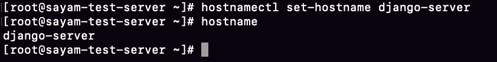
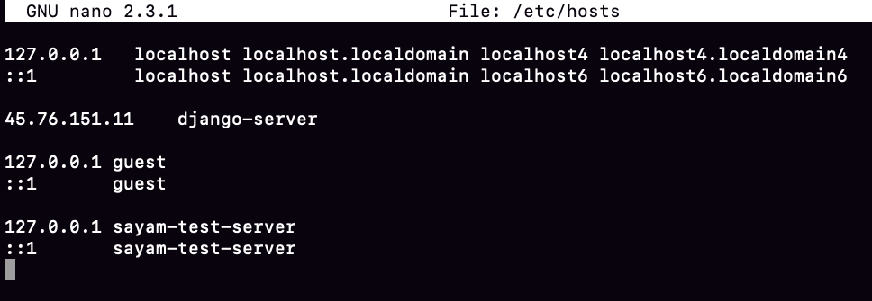
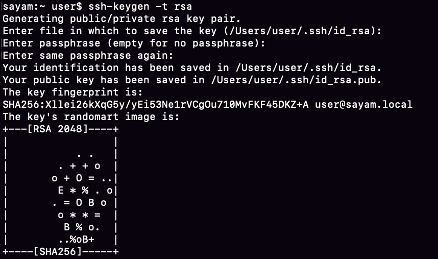
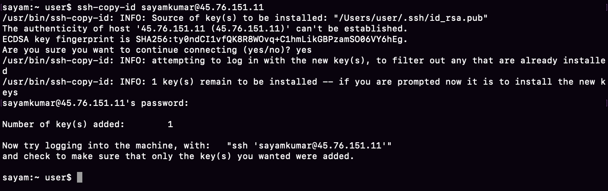
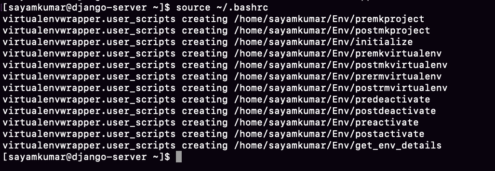
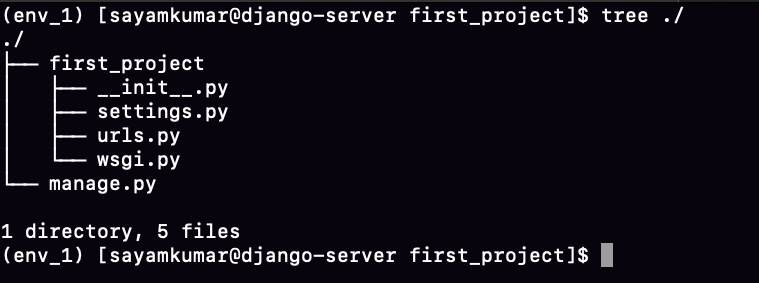
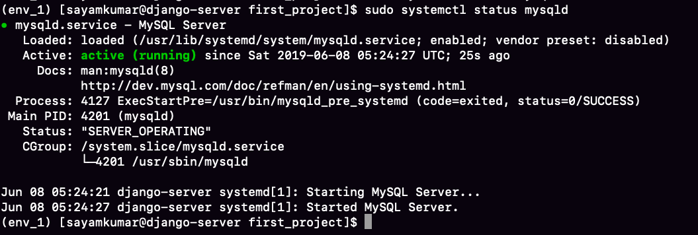
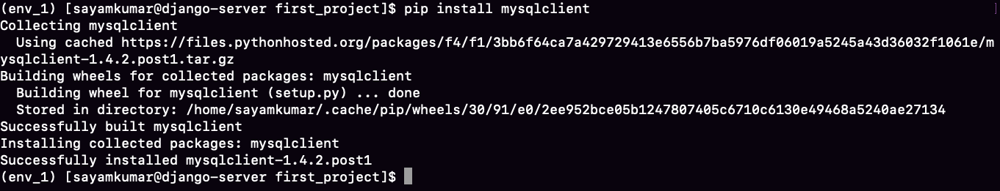
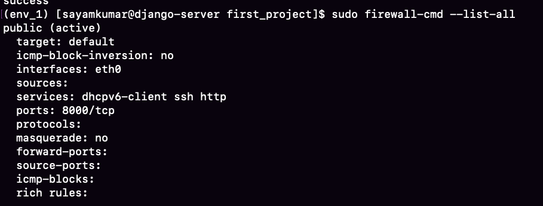
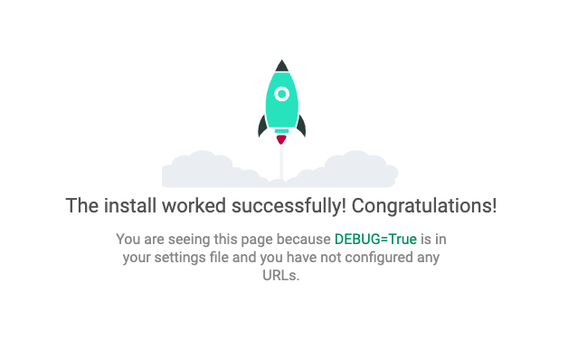

In this tutorial, we will be deploying Django application with uwsgi and nginx on centos 7. In addition, we will be using mysql as the database.
# Configuring Centos 7 -
First of all login into your public server using the ssh command in the terminal. Remember to use your public ip.
```bash
ssh root@45.76.151.11
```
Enter the password given by the administrator.

If you are getting a warning like "LC_CTYPE: cannot change locale (UTF-8): No such file or directory", then enter the following command in your local terminal by logging out.
```bash
logout
export LC_ALL="en_US.UTF-8"
ssh root@45.76.151.11
```

Update our centos -
```bash
sudo yum update
sudo yum upgrade
```

Setup hostname for our django-server -
```bash
hostnamectl set-hostname django-server
hostname
```


Setp hostname in the hosts file -
```bash
sudo nano /etc/hosts
```
Add your [ip-adress][tab][your-hostname] like this -



Add a new user -
```bash
adduser sayamkumar
passwd sayamkumar
gpasswd -a sayamkumar wheel #adding sudo privileges
logout
```

Setup ssh keys for authentication in your local machine. Hit enter for default actions -
```bash
ssh-keygen -t rsa #generating keys
```

```bash
ssh-copy-id sayamkumar@45.76.151.11 #coping the keys to the server
```


Now you can ssh login without password for the new user -
```bash
ssh sayamkumar@45.76.151.11
```

Change configuration in /etc/ssh/sshd_config, thereby making our server more secure -<br/>
PermitRootLogin no<br/>
PasswordAuthentication no
```bash
sudo nano /etc/ssh/sshd_config
sudo systemctl restart sshd
```

# Installing the prerequisites
#### Installing python3.6
```bash
sudo yum install tree
sudo yum install epel-release
sudo yum install -y https://centos7.iuscommunity.org/ius-release.rpm
sudo yum update
sudo yum install -y python36u python36u-libs python36u-devel python36u-pip
```
#### Upgrading pip and installing virtualenv
```bash
sudo pip3.6 install --upgrade pip
sudo pip install virtualenv virtualenvwrapper
```
#### Configuring the shell

We will now be using Env directory in the home directory to hold all our virtual environments. This can be configured in our initialization script.
```bash
echo "export WORKON_HOME=~/Env" >> ~/.bashrc
echo "source /usr/bin/virtualenvwrapper.sh" >> ~/.bashrc
sudo nano /usr/bin/virtualenvwrapper.sh
```
change VIRTUALENVWRAPPER_PYTHON="$(command \which python)" to VIRTUALENVWRAPPER_PYTHON="$(command \which python3.6)"
```bash

source ~/.bashrc
```


# Creating django project

First, Create a virtual environment to isolate our django project from the system's configurations.
```bash
mkvirtualenv env_1
```  
The environment env_1 gets automatically activated. The same can be verified by -
```bash
which pip
#output: ~/Env/env_1/bin/pip
```
#### Installing django
```bash
pip install django
python -m django --version #output 2.2.2
```

#### Creating our first sample project
```bash
django-admin startproject first_project
cd first_project/
tree ./
```
The structure of our project looks like



Make sure to activate the virtual environment when you want to make changes in the project.
```bash
deactivate #coming out of the virtual environment
workon env_1
```

#### Installing mysql
```bash
sudo rpm -ivh https://dev.mysql.com/get/mysql80-community-release-el7-1.noarch.rpm
```
Check if Mysql repo has been enabled
```bash
sudo yum repolist all | grep mysql | grep enabled
sudo yum -y install mysql-community-server
sudo systemctl start mysqld
sudo systemctl enable mysqld
sudo systemctl status mysqld
```


Catch the mysql temporary root password.
```bash
cat /var/log/mysqld.log | grep -i 'temporary password'
mysql_secure_installation
```
Enter the temporary password copied from previous command. Change the root password and hit Enter for default actions of mysql.
```bash
mysql -u root -p
mysql> SHOW DATABASES;
mysql> CREATE DATABASE first_db;
mysql> exit
```
List all the available packages from the MySQL repo -
```bash
sudo yum --disablerepo=\* --enablerepo='mysql*-community*' list available

sudo yum install -y mysql-connector-python.x86_64 mysql-community-devel.x86_64 mysql-cluster-community-client.x86_64 mysql-shell.x86_64 mysql-router.x86_64 gcc
pip install mysqlclient # inside the virtual environment
```


#### Changing settings.py file
With everything installed, let's change some settings for our project.

```bash
sudo nano ~/first_project/first_project/settings.py
```
Add the following line to the last. As we will be using nginx to deploy our application, this line tells django to place our static files in 'static' directory. This helps nginx to easily serve these static files.
```bash
STATIC_ROOT = os.path.join(BASE_DIR, "static/")
```
Do not forget to change the default database configurations to -
```python
DATABASES = {
    'default': {
        'ENGINE': 'django.db.backends.mysql',
        'NAME': 'first_db',
        'USER': 'root',
        'PASSWORD': 'your-root-password',
        'HOST': 'localhost',
        'PORT': '',
    }
}
```
And also add your ip in the allowed hosts
```python
ALLOWED_HOSTS = ['your_ip']
```


#### Opening port 8000
```bash
sudo firewall-cmd --permanent --add-service=http
sudo firewall-cmd --permanent --add-port=8000/tcp
sudo firewall-cmd --complete-reload
sudo firewall-cmd --list-all
```

```bash
python manage.py collectstatic
python manage.py migrate
python manage.py runserver 0.0.0.0:8000
```
Go to the web browser and enter your_ip:8000 to access the django application.



# Setting up uWSGI and nginx
```bash
sudo yum install -y python-devel
```
#### Configuring uWSGI globally
Store all our configuration files to /etc/uwsgi/sites.
```bash
sudo pip install uwsgi
sudo mkdir -p /etc/uwsgi/sites
cd /etc/uwsgi/sites
sudo nano first_project.ini
```

Add the following lines to the ini file.
```bash
[uwsgi]
project = first_project
username = sayamkumar
base = /home/%(username)

chdir = %(base)/%(project)
home = %(base)/Env/env_1
module = %(project).wsgi:application

master = true
processes = 5

uid = %(username)
socket = /run/uwsgi/%(project).sock
chown-socket = %(username):nginx
chmod-socket = 660
vacuum = true
```


Base and home contain the full path for the home directory and virtual environment respectively. We have created a master process for loading our app server. Also, we have used Unix Socket. This socket uses uWSGI protocol which helps nginx to reverse proxy.

```bash
sudo nano /etc/systemd/system/uwsgi.service
```
Add the following lines -
```bash
[Unit]
Description=uWSGI Emperor service

[Service]
ExecStartPre=/usr/bin/bash -c 'mkdir -p /run/uwsgi; chown sayamkumar:nginx /run/uwsgi'
ExecStart=/usr/bin/uwsgi --emperor /etc/uwsgi/sites
Restart=always
KillSignal=SIGQUIT
Type=notify
NotifyAccess=all

[Install]
WantedBy=multi-user.target
```

[Unit] section describes our service.</br> [Service] section manages various applications.</br>
[Install] section ties up multi-user system state.</br>

#### Installing Nginx
```bash
sudo yum -y install nginx
sudo nano /etc/nginx/nginx.conf
```
Add the following lines -

```bash
server {
    listen 8000;
    server_name localhost;

    location = favicon.ico { access_log off; log_not_found off; }
    location /static/ {
        root /home/sayamkumar/first_project;
    }

    location / {
        include uwsgi_params;
        uwsgi_pass unix:/run/uwsgi/first_project.sock;
    }
}
```
Above, we have set up a server block, with an open port to listen from. We have also specified the static file location and passed all the traffic to unix socket.
</br>
Make sure the syntax of nginx file is correct and change some permissions of the user.
```bash
sudo nginx -t
sudo usermod -a -G sayamkumar nginx
chmod 710 /home/sayamkumar
```
Start and enable the nginx and uwsgi.
```bash
sudo systemctl start nginx
sudo systemctl start uwsgi
sudo systemctl enable nginx
sudo systemctl enable uwsgi
```

Now you can directly access the project from the ip with an open port.
</br>
Thanks for reading!
